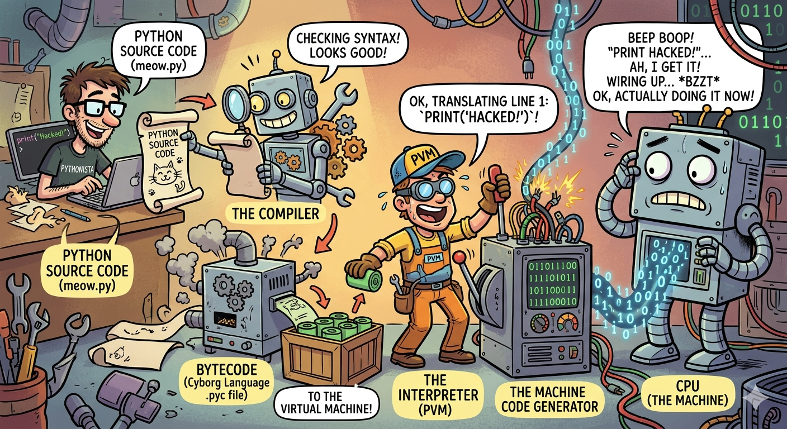

# Module 1: Introduction to Programming & Python

> 🎉 Welcome! No prior tech experience needed. If you've ever used a microwave, you're already halfway there.

---

## 🤔 What Even IS Programming?

Let's start with a wild fact:

!!! info "Mind-blowing fact 🤯"
    Your computer — that fancy, expensive machine — is, at its core, just a **box of switches**.

    That's it. Millions of tiny switches that are either **ON** or **OFF**.

Computers don't understand English. They don't understand Hindi. They don't even understand "please".

They only understand **two things**:

| What the computer sees | What it means |
|---|---|
| `1` | Switch ON ⚡ |
| `0` | Switch OFF 💤 |

This is called **Binary** — and it looks like this:

```
01001000 01100101 01101100 01101100 01101111
```

You know what that says? It says **"Hello"**. 😅

Imagine having to write that every time you wanted to say hi to someone. Exhausting, right?

---

## 🌉 The Bridge Between Humans and Machines

So here's the problem:

- **Humans** think in words, logic, and ideas 🧠
- **Computers** think in 0s and 1s 🤖

That gap needed a solution — and that solution is a **Programming Language**.

!!! success "Think of it like this 💡"
    A programming language is like a **translator** standing between you and the computer.

    You say: *"Hey, add these two numbers."*
    The translator converts it to: `01001000 10110010...`
    The computer does it instantly. ✅

You write something like this:

```python
print(2 + 2)
```

And the computer figures out the rest. No binary required from your side. 🙌

---

## 🌍 Why Do We Even Need Programming?

Here's the honest truth — computers have **two superpowers** that humans simply don't have:

=== "⚡ Speed"

    A computer can do **billions of calculations per second**.

    You? Maybe 2-3 per second (on a good day, with coffee ☕).

=== "🤖 Consistency"

    A computer **never gets bored**, never gets tired, and never makes "oops I added wrong" mistakes.

    You? After the 50th repetitive task... we all know what happens. 😴

### So what does this mean in real life?

- 📱 It runs your phone, your apps, your Instagram feed
- 🚗 It powers self-driving cars and GPS navigation
- 🌦️ It processes massive weather data to predict tomorrow's rain
- 📊 It handles stock markets processing millions of trades per second
- 🔁 It automates boring, repetitive tasks — so **you** can focus on the creative stuff

!!! quote "The big idea"
    You aren't just "typing code". You are **solving problems** and **automating the boring stuff** so humans can do what they do best — think, create, and innovate.

---

## 🗺️ The Big Picture

Here's a visual to tie it all together 👇

.png)

---

## 🐍 So Why Python?

There are hundreds of programming languages out there — Java, C++, JavaScript, and more. So why are we learning Python?

Because Python reads almost like **plain English**. Compare:

=== "Python 🐍"
    ```python
    if temperature > 100:
        print("It's too hot!")
    ```

=== "C++ 😰"
    ```cpp
    #include <iostream>
    using namespace std;
    int main() {
        int temperature = 105;
        if (temperature > 100) {
            cout << "It's too hot!" << endl;
        }
        return 0;
    }
    ```

Same result. Very different experience. Python wins for beginners — every time. 🏆

!!! tip "Fun fact 🐍"
    Python is named after the British comedy show **Monty Python's Flying Circus** — not the snake. The creator wanted the language to be fun. Mission accomplished.

---

## 🐍 What is Python?

Python is a **high-level programming language** — meaning it's designed to be easy for *humans* to read and write, not just machines.

- **Like a Translator:** Python acts as a bridge between you and the computer. You write instructions in "English-like" code, and Python handles the translation to machine language behind the scenes.
- **General Purpose:** Python isn't locked into one field. It powers:
    - 🌐 Web development (Django, Flask)
    - 🤖 AI & Machine Learning (TensorFlow, PyTorch)
    - 📊 Data Science (Pandas, NumPy)
    - 🗺️ GIS & Spatial Analysis (GeoPandas, ArcPy)
    - ⚙️ Automation & scripting
- **Beginner-Friendly:** Its syntax (the rules for writing code) is dramatically simpler than languages like C++ or Java.

---

## 🌍 Why is Python So Popular (Especially in GIS)?

Python's popularity in the GIS world isn't just about being easy to learn. It has become the **"glue"** that connects data, software, and advanced science.

While standard Python is great, its real power comes from thousands of free **libraries** — pre-written code that handles complex tasks in just a few lines.

---

### 1. ⚡ Automation — Do More Work in Less Time

In GIS, many tasks are repetitive — processing hundreds of maps, converting formats, applying the same styling over and over.

=== "😩 Without Python"
    Click the same buttons. Again. And again. For every single file.
    500 satellite images = 500 times of manual clicking. Good luck. 🫠

=== "🚀 With Python"
    Write one script. Run it once. All 500 images processed automatically.
    Go grab a coffee while the computer does the work. ☕

!!! example "Real-world example 🛰️"
    You have **500 satellite images** and need to:

    - Clip them to a specific area
    - Convert their formats
    - Apply the same styling

    A Python script handles all 500 in **a few seconds**. No clicking required.

---

### 2. 🧰 Powerful GIS Libraries — Pre-built Tools

Python has special libraries (toolkits) built specifically for GIS work.

| Library | What it does |
|---|---|
| **ArcPy** | Used inside ArcGIS |
| **PyQGIS** | Used inside QGIS |
| **GeoPandas** | Works like Excel, but for maps 🗺️ |
| **GDAL** | Reads & writes spatial data formats |

!!! example "Real-world example 🏘️"
    Want to find all villages within **5 km of a river**?
    With these libraries, that's a few lines of Python — instead of complex manual steps.

---

### 3. 🔌 Works Inside Major GIS Software

Most GIS software already ships with Python built in. You can use it directly inside tools you already know.

- ArcGIS Pro
- QGIS
- GRASS GIS

This means you can create custom tools, automate workflows, and build your own GIS applications — all from within the software.

!!! example "Real-world example 🏙️"
    A city planner builds a **custom button in QGIS** that:

    1. Loads traffic data
    2. Analyzes congestion
    3. Generates a report — instantly

---

### 4. 📦 Handles Big & Complex Data Easily

GIS often deals with massive datasets — satellite images, GPS tracks, population records. Python helps you clean, analyze, and visualize all of it.

!!! example "Real-world example 🌊"
    Disaster management teams use Python to:

    - Analyze flood zones
    - Predict affected areas
    - Plan evacuation routes

---

### 5. 🌐 Huge Community & Learning Support

Python has one of the largest developer communities in the world. If you get stuck:

- Tutorials are everywhere
- Forums already have your answer
- Tons of free resources available

!!! tip "Stuck on an error? 🔍"
    If you hit a bug while using GeoPandas, chances are someone already solved it and posted the answer on Stack Overflow. Just Google the error message — seriously, it works.

.png)

---

??? info "🔧 Bonus: How Python Works Under the Hood (For the Curious)"

    You don't *need* this to start coding — but if you're curious about what happens when you hit "Run", here it is.

    ### What is Bytecode?

    When you run a `.py` file, Python doesn't execute your text directly. It first translates it into **Bytecode** (stored in `.pyc` files) — a low-level set of instructions that's easier for the Python engine to process, but not yet the binary your CPU understands.

    ### Is Python Compiled or Interpreted? (It's Both 🤯)

    - **Step 1 — Compilation:** Python automatically compiles your source code into Bytecode.
    - **Step 2 — Interpretation:** The Python interpreter reads that Bytecode line-by-line and executes it.

    We call it "interpreted" because the compilation happens invisibly — you never manually build anything.

    ### The Python Virtual Machine (PVM)

    The **PVM** is the heart of the Python engine. It takes Bytecode and converts it into the final machine code your specific computer can run.

    ### Why Python is Platform Independent

    - Write a script on Windows → run it on Mac or Linux without changing a single line.
    - The Bytecode is **universal** — it looks the same on every system.
    - Only the PVM needs to be different per OS. As long as the right PVM is installed, your code runs anywhere.

    ---

    ### What is a Python Interpreter?

    The interpreter reads and executes your Python code directly, line-by-line in real-time. Here's what happens step-by-step when you run `python myscript.py`:

    1. **Lexical Analysis (Tokenization):** Breaks your code into small meaningful pieces — keywords, variables, symbols.
    2. **Syntax Check (Parsing):** Checks your code follows Python's grammar. A missing colon? It stops here with a `SyntaxError`.
    3. **Bytecode Compilation:** Translates your readable code into Bytecode.
    4. **Execution (PVM):** The PVM converts Bytecode into machine code (0s and 1s) your CPU actually runs.

    ### Types of Python Interpreters

    | Interpreter | What's special |
    |---|---|
    | **CPython** | The standard version from python.org (written in C) |
    | **PyPy** | Faster — uses Just-In-Time (JIT) compilation |
    | **Jython** | Runs Python on the Java platform |
    | **MicroPython** | Tiny version for microcontrollers & small hardware |

    ### Interpreter vs. Compiler

    | Feature | Interpreter (Python) | Compiler (C++) |
    |---|---|---|
    | **Translation** | Line-by-line while running | Entire file at once, before running |
    | **Output** | No separate file created | Generates a standalone `.exe` |
    | **Debugging** | Stops at first error found | Shows all errors after compiling |
    | **Speed** | Generally slower | Generally faster |

    

---

## 🧱 Fundamental Building Blocks of Coding

> Whether you end up building websites, AI models, or GIS tools — these are the **universal building blocks** of ALL programming. Learn them once in Python, and you can pick up any other language much faster.

We call them the **"Big 7"** 🎯

---

### 1. 📦 Variables & Data Types — *The Storage*

Think of a variable as a **labeled box** where you store information.

```python
city_name = "New York City"      # 📝 String  — text
parcel_count = 105               # 🔢 Integer — whole number
latitude = 40.7128               # 🌊 Float   — decimal number
is_within_boundary = True        # ✅ Boolean — True or False
```

| Type | What it stores | Example |
|---|---|---|
| **String** | Text | `"Riverside Road"` |
| **Integer** | Whole numbers | `105` |
| **Float** | Decimal numbers | `40.7128` |
| **Boolean** | Yes/No, True/False | `True` |

!!! note "Real-world analogy 🗂️"
    Imagine you're filling out a form. Name → String. Age → Integer. GPA → Float. Are you a student? → Boolean. Same idea!

---

### 2. 🗄️ Data Structures — *The Organizers*

What if you have a **collection** of things to store? That's where data structures come in.

```python
# List — ordered sequence (like a numbered to-do list)
waypoints = ["Point_A", "Point_B", "Point_C"]

# Dictionary — key-value pairs (like a real dictionary: word → meaning)
city_info = {"City": "Mumbai", "Population": 20000000}
```

!!! tip "Think of it like this 🧺"
    - A **List** is like a shopping list — items in order, one after another.
    - A **Dictionary** is like a contact book — you look up a name (key) to get a phone number (value).

---

### 3. ➕ Operators — *The Math & Logic*

These are the tools for **calculating and comparing** things.

```python
# Arithmetic — basic math
area = length * width
distance = total_km / days

# Comparison — asking questions
10 > 5      # True  — is 10 greater than 5?
"a" == "b"  # False — are these equal?
5 != 3      # True  — are these NOT equal?

# Logical — combining conditions
is_dry = True
is_outside_city = True
can_build = is_dry and is_outside_city  # True only if BOTH are true
```

---

### 4. 🧠 Control Flow: If/Else — *The Decision Maker*

This is where your code starts to **think**. Based on a condition, it takes different paths.

```python
elevation = 1200

if elevation > 1000:
    color = "brown"   # 🟤 High altitude
else:
    color = "green"   # 🟢 Low altitude
```

!!! info "Real-world analogy 🚦"
    It's exactly like a traffic light. **If** the light is green → go. **Else if** it's yellow → slow down. **Else** → stop. Your code makes decisions the same way.

---

### 5. 🔁 Loops — *The Task Repeater*

Computers never get tired. Loops let you **repeat a task** without writing the same code 100 times.

```python
# For Loop — repeat for each item in a list
shapefiles = ["roads.shp", "rivers.shp", "parks.shp"]

for file in shapefiles:
    clip_to_boundary(file)   # Do this for EVERY file automatically

# While Loop — keep going until a condition is met
errors_found = True
while errors_found:
    errors_found = check_for_errors()   # Keep checking until clean ✅
```

!!! success "Why this is powerful 💪"
    Imagine you have 500 files to process. Without a loop: 500 lines of code. With a loop: 3 lines. That's the magic.

---

### 6. ♻️ Functions — *The Reusable Tool*

Instead of writing the same logic over and over, you **wrap it in a function** and call it whenever you need it.

```python
def calculate_buffer(location, distance):
    # All the complex logic lives here
    result = location + distance   # simplified example
    return result

# Now use it anywhere, anytime!
buffer_A = calculate_buffer("Point_A", 500)
buffer_B = calculate_buffer("Point_B", 1000)
```

!!! tip "The coffee machine analogy ☕"
    A function is like a **coffee machine**.
    - You give it **beans** (Input)
    - It does all the work inside (Process)
    - You get **coffee** (Output)

    You don't need to know how it works inside — you just press the button.

---

### 7. 🛡️ Error Handling — *The Safety Net*

Code breaks. Files go missing. Data has typos. Error handling makes sure your program **doesn't crash dramatically** when something goes wrong.

```python
try:
    open("city_map.shp")          # Try to open the file
except FileNotFoundError:
    print("Oops! File not found. Check the path and try again.")  # Graceful message
```

!!! warning "Without error handling 💥"
    Your entire program crashes with a scary red error message.

!!! success "With error handling ✅"
    Your program catches the problem, shows a friendly message, and keeps running.

---

## 🗺️ The Big 7 — Visual Summary

.png)

---

## 🎯 Quick Recap

| Concept | What it does | One-liner analogy |
|---|---|---|
| **Variables** | Store data | Labeled boxes 📦 |
| **Data Structures** | Organize collections | Shopping list & contact book 🗂️ |
| **Operators** | Math & comparisons | Calculator + logic 🧮 |
| **If/Else** | Make decisions | Traffic light 🚦 |
| **Loops** | Repeat tasks | Robot doing chores 🤖 |
| **Functions** | Reusable code blocks | Coffee machine ☕ |
| **Error Handling** | Catch & handle failures | Safety net 🛡️ |

!!! success "You're ready! 🚀"
    These 7 concepts are the **entire foundation** of programming. Everything else — AI, web apps, GIS tools — is just these 7 things combined in clever ways. In the next modules, we'll deep dive into each one with hands-on Python code.
