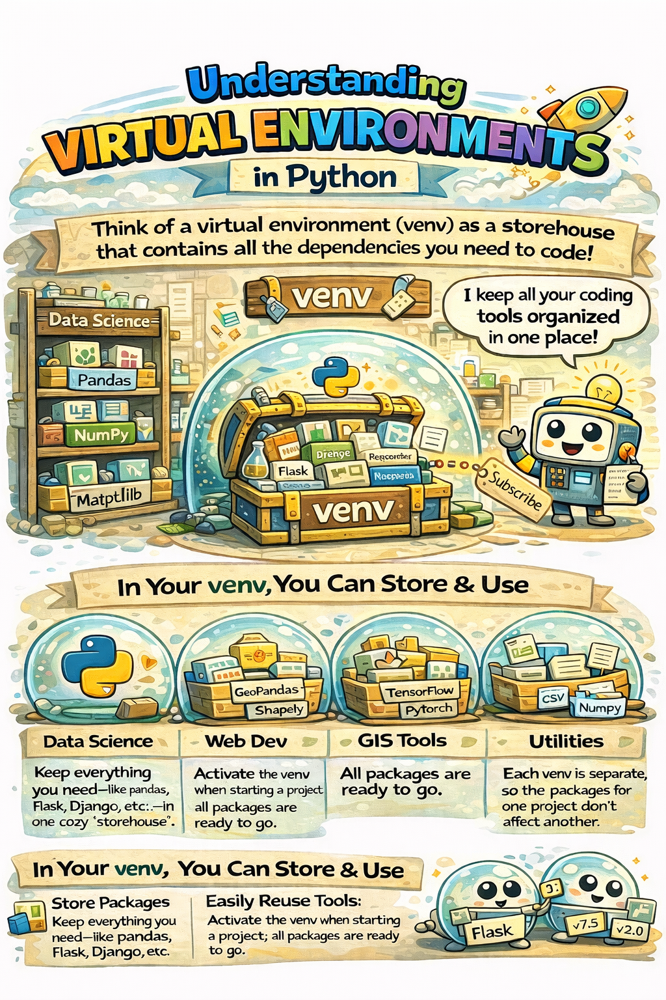

# Module 2: Python Setup & Virtual Environments

> ⚙️ Before we write any real code, we need to set up our workspace. Think of this like setting up your desk before starting work — the right tools in the right place make everything easier.

---

## 📦 What are Python Packages?

Python by itself is powerful. But its **real superpower** comes from packages.

!!! info "What's a package? 📦"
A Python package (also called a library or module) is a collection of **pre-written code** that someone else already built and shared for free.

    Instead of writing complex math or map-processing code from scratch, you just **install a package and use it**.

Some examples you'll use a lot:

| Package          | What it does                              |
| ---------------- | ----------------------------------------- |
| **Pandas**       | Data analysis — like Excel, but in Python |
| **NumPy**        | Scientific computing & math               |
| **GeoPandas**    | Spatial data — maps in Python             |
| **scikit-learn** | Machine learning                          |
| **Matplotlib**   | Charts & visualizations                   |

!!! tip "Where do packages live? 🏠"
The central hub for Python packages is **PyPI** (Python Package Index).
Browse thousands of free packages at [pypi.org](https://pypi.org/)

---

## 🔧 What is `pip`?

`pip` is Python's built-in **package installer**. It connects to PyPI and downloads packages directly to your machine.

Think of `pip` like an **app store for Python** — you search, install, and manage packages from the command line.

```bash
# Install a package
pip install pandas

# Install a specific version
pip install pandas==2.1.0

# Upgrade a package
pip install --upgrade pandas

# See all installed packages
pip list
```

!!! success "That's it! 🎉"
One command and the package is ready to use. No manual downloading, no complicated setup.

---

## 🤔 Why Do We Need Virtual Environments?

Here's a real problem that every developer faces:

!!! warning "The version conflict problem 😬" - **Project A** (your old GIS tool) needs `pandas version 1.3` - **Project B** (your new AI project) needs `pandas version 2.1`

    If you install both on the same Python, they **conflict**. One project breaks.

The solution? **Virtual Environments** — isolated bubbles where each project has its own packages and versions, completely separate from everything else.

```
Your Computer
├── 🫧 Environment for Project A  →  pandas 1.3, arcpy 3.0
├── 🫧 Environment for Project B  →  pandas 2.1, tensorflow 2.13
└── 🫧 Environment for Project C  →  geopandas 0.14, qgis 3.28
```

Each bubble is independent. Installing or upgrading in one **never affects** the others. ✅



---

## 🛠️ Ways to Create Virtual Environments

### Option 1: `venv` — Python's Built-in Tool

`venv` comes with Python 3.3+ — no installation needed.

```bash
# Step 1: Create the environment
python -m venv my_project_env

# Step 2: Activate it
# On Windows:
my_project_env\Scripts\activate

# On macOS/Linux:
source my_project_env/bin/activate

# Step 3: You'll see the env name in your terminal prompt
# (my_project_env) C:\Users\you>

# Step 4: Deactivate when done
deactivate
```

---

### Option 2: `conda` — The Data Science Powerhouse ⭐

`conda` is more powerful than `venv`. It manages not just Python packages but also non-Python dependencies (like C libraries that spatial tools need).

!!! tip "Recommended for GIS & Data Science work 🗺️"
If you're working with ArcPy, GeoPandas, or any scientific computing — **conda is the better choice**.

**Install Miniconda** (the lightweight version of conda):
👉 [docs.conda.io/en/latest/miniconda.html](https://docs.conda.io/en/latest/miniconda.html)

```bash
# Step 1: Create an environment with a specific Python version
conda create --name my_gis_env python=3.11

# Step 2: Activate it
conda activate my_gis_env

# Step 3: Install packages (conda has its own package repository)
conda install geopandas

# Or use pip inside conda too
pip install some_package

# Step 4: Deactivate when done
conda deactivate
```

---

### Option 3: Other Tools (Quick Mention)

| Tool         | Best for                                                |
| ------------ | ------------------------------------------------------- |
| **`pipenv`** | Automatically manages `Pipfile` — good for web projects |
| **`poetry`** | Modern dependency management + packaging                |

For this course, we'll stick with **`venv`** and **`conda`**. They cover 95% of use cases.

---

## 📋 What is `requirements.txt`?

When you finish a project, how do you share your setup so others can run your code without issues?

Answer: a `requirements.txt` file — a simple list of all packages and their exact versions.

```bash
# Generate it from your current environment
pip freeze > requirements.txt
```

It creates a file that looks like this:

```text title="requirements.txt"
geopandas==0.14.1
pandas==2.1.0
numpy==1.26.0
matplotlib==3.8.0
```

```bash
# Someone else (or you on a new machine) installs everything at once
pip install -r requirements.txt
```

!!! success "Why this matters 🤝"
Share your `requirements.txt` with your team or students and they can recreate your **exact environment** in one command. Your code "just works" on their machine.

---

## 🐍 How to Install Python

=== "🪟 Windows"

    **Option 1 — Official installer (recommended for beginners):**

    1. Go to [python.org/downloads](https://www.python.org/downloads/)
    2. Download the latest version
    3. Run the installer
    4. ⚠️ **Important:** Check the box that says **"Add Python to PATH"** before clicking Install

    **Option 2 — Chocolatey (package manager):**
    ```bash
    choco install python
    ```

=== "🍎 macOS"

    **Option 1 — Official installer:**
    Download from [python.org/downloads](https://www.python.org/downloads/)

    **Option 2 — Homebrew:**
    ```bash
    brew install python
    ```

=== "🐧 Linux"

    Python usually comes pre-installed. To install or update:
    ```bash
    # Debian/Ubuntu
    sudo apt install python3

    # Fedora/RHEL
    sudo dnf install python3
    ```

---

## 📓 What is Jupyter Notebook?

Jupyter Notebook is a **web-based interactive coding environment** where you can write code, run it, see the output, and add explanatory text — all in one document.

!!! info "Think of it like this 📄"
A regular Python script is like a **Word document** — you write everything, then run it all at once.

    A Jupyter Notebook is like a **live interactive worksheet** — you run one section at a time and see results immediately.

**Why it's great for learning:**

- ✅ Run code **cell by cell** — see results instantly
- ✅ Mix code with **text, images, and charts** in one place
- ✅ Perfect for **data exploration** and experimentation
- ✅ Easy to **share** as a self-documenting file

### Running Python Code

=== "▶️ From the Terminal"

    ```bash
    # Navigate to your file's folder
    cd path/to/your/folder

    # Run the script
    python my_script.py
    ```

=== "📓 In Jupyter Notebook"

    - Type your code in a cell
    - Press **`Shift + Enter`** to run it
    - Output appears directly below the cell

    ```python
    # Run an external script from inside a notebook
    %run my_script.py

    # Or as a shell command
    !python my_script.py
    ```

---

## ☁️ Google Colab — No Setup Required!

Don't want to install anything yet? **Google Colab** is a free, cloud-based Jupyter Notebook that runs entirely in your browser.

!!! success "Zero setup. Just open and code. 🚀" - No installation needed - Free GPU access for heavy tasks - Saves directly to Google Drive - Perfect for learning and sharing

👉 **Open the course notebook here:**
[Open in Google Colab](https://colab.research.google.com/drive/1BKSiwVQ2x7qSZTnU79Geg6unJ2zz9d8l?usp=sharing)

## 🎯 Quick Recap

| Concept                 | What it is                     | Why it matters                 |
| ----------------------- | ------------------------------ | ------------------------------ |
| **Package**             | Pre-written code you install   | Don't reinvent the wheel 🎡    |
| **pip**                 | Package installer              | Your Python app store 🛒       |
| **Virtual Environment** | Isolated project bubble        | No version conflicts 🫧        |
| **venv**                | Built-in env tool              | Simple & lightweight           |
| **conda**               | Powerful env + package manager | Best for GIS & data science 🗺️ |
| **requirements.txt**    | List of project dependencies   | Reproducible setups 📋         |
| **Jupyter Notebook**    | Interactive coding environment | See results instantly 📓       |
| **Google Colab**        | Cloud-based Jupyter            | Zero setup needed ☁️           |

!!! success "You're set up! 🎉"
In the next module, we'll start writing actual Python code — variables, data types, and your first real script. The fun begins now.
