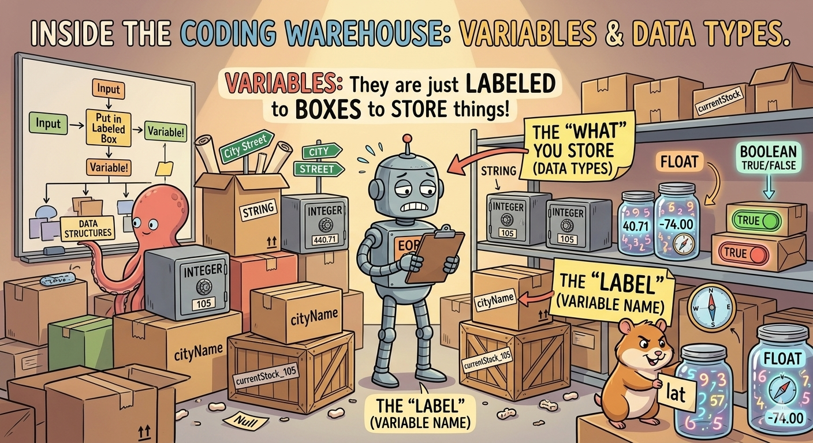

# Module 3: Variables, Operators & Data Types

> 🧠 This is where your code gets a memory. Without variables, your program forgets everything the moment it runs — like that one friend who never remembers anything.

---

## 📦 What is a Variable? (The Real-World Analogy)

Before we touch any code, let's think about the real world.

Imagine a **warehouse** full of containers. Each container:

- Has a **label** on it (so you know what's inside)
- Holds a **specific type of material** (you don't put water in a box meant for bricks)
- Can be **opened and changed** anytime

That's exactly what variables are in programming — **labeled containers for storing information**.

!!! info "The container analogy 🏭" - A jar labeled `sugar` holds sugar 🍬 - A bottle labeled `water` holds water 💧 - A box labeled `books` holds books 📚

    In code:
    ```python
    sugar = 500       # grams
    water = 2.5       # liters
    books = 3         # count
    ```

Now here's where Python gets interesting...

### 🐍 Python's Smart Containers

In most languages, you have to declare what _type_ of container you're using before you put anything in it. Python doesn't care. Python's containers are **flexible** — they can hold anything, and you can change what's inside anytime.

```python
x = 10        # x holds a number
x = "Hello"   # now x holds text — Python is totally fine with this
x = 3.14      # now x holds a decimal — still fine!
```

This is called **dynamic typing** — Python figures out the type automatically based on what you put in.



---

## 🧠 Why Do We Even Need Variables?

Think about this: what if every time you needed your name in a program, you had to type `"Alice"` manually — 50 times across 200 lines of code? Then your name changes. Now you have to find and fix all 50 places. 😩

Variables solve this:

```python
student_name = "Alice"   # define once

print(student_name)      # use it anywhere
print(f"Welcome, {student_name}!")
print(f"Hello {student_name}, your report is ready.")
```

Change it in one place → updates everywhere. ✅

Here's the full picture of why variables matter:

| Reason                   | What it means                                                       |
| ------------------------ | ------------------------------------------------------------------- |
| **Temporary Storage**    | Hold data while your program runs (user input, results, file paths) |
| **Reusability**          | Define once, use everywhere — no copy-pasting values                |
| **Readability**          | `total_price` is clearer than `99.99` scattered everywhere          |
| **Dynamic Calculations** | Work with data you don't know yet (scores, counters, results)       |
| **GIS Data Management**  | Label coordinates, file paths, layer names clearly                  |

!!! tip "The sticky note analogy 🗒️"
Your brain is the computer. Your thoughts are data. Variables are **sticky notes** you use to label those thoughts.

    - Data: `95`
    - Variable: `math_score`

    When someone asks your score, you don't recall the number — you just look at the sticky note labeled `math_score`.

---

## ✏️ Creating & Reassigning Variables

Creating a variable in Python is as simple as:

```python
name = "Pritam"
age = 25
salary = 50000

print(name)    # Pritam
print(age)     # 25
print(salary)  # 50000
```

And you can **reassign** them anytime — the old value is simply replaced:

```python
name = "Python"
age = 70
salary = 2000

print(name)    # Python
print(age)     # 70
print(salary)  # 2000
```

---

## 📏 Rules for Naming Variables

Python has a naming standard called **`snake_case`** — all lowercase, words separated by underscores. This comes from Python's style guide called **PEP 8**.

### The Golden Rules

| Rule               | Description                                                          |
| ------------------ | -------------------------------------------------------------------- |
| **Be Descriptive** | `user_age` not `a` — make it obvious what it holds                   |
| **snake_case**     | `lowercase_with_underscores`                                         |
| **No Keywords**    | Don't use `print`, `if`, `list`, `class` — Python already uses these |
| **Case Sensitive** | `my_var` and `My_Var` are two completely different variables         |

### ✅ Correct vs ❌ Wrong

| Status | Variable Name          | Why?                                           |
| ------ | ---------------------- | ---------------------------------------------- |
| ✅     | `student_name = "Sam"` | Descriptive, lowercase, underscores            |
| ❌     | `1st_student = "Sam"`  | Cannot start with a number                     |
| ✅     | `total_price = 49.99`  | Clear, follows snake_case                      |
| ❌     | `total price = 49.99`  | Spaces are not allowed                         |
| ✅     | `_temp_value = 10`     | Underscore start is allowed                    |
| ❌     | `class = "Math"`       | `class` is a reserved Python keyword           |
| ✅     | `is_valid = True`      | Great naming for True/False values             |
| ❌     | `is-valid = True`      | Hyphens not allowed — Python reads it as minus |

```python
# ✅ Correct
student_name = "Alice"
total_price = 129.99
is_active_user = True
buffer_distance_meters = 100

# ❌ These would cause errors (uncomment to see)
# 1st_name = "Bob"
# total-cost = 50
# class = "Science"
# item id = 123
```

!!! tip "GIS-specific naming tip 🗺️"
Be extra descriptive when working with spatial data:

    - ✅ `buffer_distance_meters = 500` — you know it's meters
    - ❌ `dist = 500` — is it miles? meters? pixels? who knows
    - ✅ `river_shapefile_path = "C:/data/rivers.shp"`
    - ❌ `path1 = "C:/data/rivers.shp"` — path to what?

---

## 🗂️ Python Data Types

Now that we know what variables are, let's talk about **what they can hold** — the different types of data.

Python is **dynamically typed** — you don't declare the type, Python figures it out from the value you assign.

### Primitive Data Types — The Simple Ones

These store a **single value** and are the building blocks of everything else.

```python
# Integer — whole numbers
age = 30
print(f"Value: {age}, Type: {type(age)}")
# Value: 30, Type: <class 'int'>

# Float — decimal numbers
price = 19.99
print(f"Value: {price}, Type: {type(price)}")
# Value: 19.99, Type: <class 'float'>

# String — text
product_name = "Laptop"
print(f"Value: {product_name}, Type: {type(product_name)}")
# Value: Laptop, Type: <class 'str'>

# Boolean — True or False only
is_available = True
print(f"Value: {is_available}, Type: {type(is_available)}")
# Value: True, Type: <class 'bool'>
```

| Type    | What it stores        | Example                    |
| ------- | --------------------- | -------------------------- |
| `int`   | Whole numbers         | `30`, `-5`, `0`            |
| `float` | Decimal numbers       | `19.99`, `40.7128`, `-0.5` |
| `str`   | Text (any characters) | `"Hello"`, `"New York"`    |
| `bool`  | Only True or False    | `True`, `False`            |

### Dynamic Typing in Action

The same variable can hold different types at different times:

```python
x = 10          # x is an integer
print(f"x = {x}, Type: {type(x)}")

x = "Hello"     # now x is a string
print(f"x = {x}, Type: {type(x)}")

x = 3.14159     # now x is a float
print(f"x = {x}, Type: {type(x)}")
```

!!! warning "With great flexibility comes great responsibility ⚠️"
Dynamic typing is convenient, but type-related bugs can sneak in at runtime. Always be intentional about what type a variable should hold.

---

## 🏗️ Non-Primitive Data Types — The Organizers

These hold **collections** of values. They're how you organize and group related data together.

### 📋 Lists — Ordered & Changeable

A list is an **ordered sequence** of items. Think of it like a numbered to-do list — items stay in the order you put them, and you can add, remove, or change items anytime.

```python
# Creating a list
my_list = ["apple", "banana", "cherry"]
user_ids = [101, 102, 103, 104]
mixed = ["Alice", 30, True, 180.5]   # lists can hold different types!

# Accessing by index (starts at 0)
print(user_ids[0])    # 101 — first item
print(user_ids[-1])   # 104 — last item

# Slicing — grab a range
print(user_ids[1:3])  # [102, 103]

# Modifying
user_ids[1] = 105
print(user_ids)       # [101, 105, 103, 104]

# Adding items
user_ids.append(106)          # add to end
user_ids.insert(0, 100)       # insert at position 0

# Removing items
user_ids.remove(105)          # remove by value
del user_ids[0]               # remove by index
popped = user_ids.pop()       # remove & return last item
```

**Useful list operations:**

```python
nums = [5, 2, 9, 1, 5, 6]

print(len(nums))      # 6  — how many items
print(max(nums))      # 9  — largest
print(min(nums))      # 1  — smallest
print(sum(nums))      # 28 — total
print(nums.count(5))  # 2  — how many times 5 appears
print(nums.index(9))  # 2  — position of 9

# Sorting
nums.sort()                    # sort in place: [1, 2, 5, 5, 6, 9]
nums.sort(reverse=True)        # descending: [9, 6, 5, 5, 2, 1]

sorted_nums = sorted(nums)     # creates a NEW sorted list, original unchanged

# Check membership
print(2 in nums)       # True
print(5 not in nums)   # False

# Remove duplicates
unique = list(set(nums))
```

**Sorting complex data:**

```python
users = [
    {"name": "John",  "age": 25},
    {"name": "Alice", "age": 20},
    {"name": "Bob",   "age": 30}
]

users.sort(key=lambda x: x["age"])   # sort by age
print(users)
```

#### ⚡ List Comprehensions — The Shortcut

Instead of writing a loop to build a list, you can do it in one line:

```python
numbers = [1, 2, 3, 4, 5]

# Square every number
squared = [x**2 for x in numbers]
# [1, 4, 9, 16, 25]

# Only keep even numbers
evens = [x for x in numbers if x % 2 == 0]
# [2, 4]

# Uppercase words longer than 5 characters
words = ["apple", "banana", "cherry", "date"]
long_upper = [w.upper() for w in words if len(w) > 5]
# ['BANANA', 'CHERRY']

# Flatten a nested list
matrix = [[1, 2, 3], [4, 5, 6], [7, 8, 9]]
flat = [num for row in matrix for num in row]
# [1, 2, 3, 4, 5, 6, 7, 8, 9]
```

!!! tip "List comprehension syntax 📐"
`[expression for item in iterable if condition]`

    Read it left to right: "Give me `expression`, for each `item` in `iterable`, but only if `condition` is true."

---

### 🔒 Tuples — Ordered & Locked

Tuples are exactly like lists, **except you can't change them** after creation. They're immutable — locked in place.

```python
coordinates = (34.0522, -118.2437)   # GPS coordinates — shouldn't change
rgb_color = ("red", "green", "blue")

# Accessing (same as lists)
print(coordinates[0])    # 34.0522
print(coordinates[-1])   # -118.2437

# Trying to modify raises an error
try:
    coordinates[0] = 34.1234
except TypeError as e:
    print(f"Error: {e}")   # 'tuple' object does not support item assignment

# Tuple unpacking — very useful!
point_3d = (10, 20, 30)
x, y, z = point_3d
print(f"x={x}, y={y}, z={z}")   # x=10, y=20, z=30
```

!!! info "When to use a Tuple vs a List? 🤔" - Use a **List** when the data might change (a shopping cart, a list of files to process) - Use a **Tuple** when the data is fixed (GPS coordinates, RGB values, days of the week)

    Tuples are also slightly faster than lists and can be used as dictionary keys.

---

### 🎯 Sets — Unique Items Only

A set is an **unordered collection of unique items**. Duplicates are automatically removed. Great for membership testing and set math.

```python
# Duplicates are removed automatically
user_prefs = set(["movies", "music", "sports", "music"])
print(user_prefs)   # {'movies', 'music', 'sports'} — 'music' only once

# Adding items
user_prefs.add("gaming")
user_prefs.update(["cooking", "travel"])

# Removing items
user_prefs.remove("gaming")    # raises error if not found
user_prefs.discard("yoga")     # no error if not found

# Membership check (very fast)
print("music" in user_prefs)   # True

# Set math operations
set_a = {1, 2, 3, 4}
set_b = {3, 4, 5, 6}

print(set_a.union(set_b))               # {1, 2, 3, 4, 5, 6} — all items
print(set_a.intersection(set_b))        # {3, 4}             — common items
print(set_a.difference(set_b))          # {1, 2}             — in A but not B
print(set_a.symmetric_difference(set_b))# {1, 2, 5, 6}       — not in both
```

!!! warning "Empty set gotcha ⚠️"
`{}` creates an empty **dictionary**, not a set!
Always use `set()` for an empty set.

---

### 📖 Dictionaries — Key-Value Pairs

A dictionary stores data as **key → value** pairs. Like a real dictionary: you look up a word (key) to get its meaning (value). Perfect for structured data.

```python
user_config = {"theme": "dark", "notifications": True, "timeout": 300}

# Accessing values
print(user_config["theme"])                          # dark
print(user_config.get("notifications"))              # True
print(user_config.get("api_key"))                    # None — no error!
print(user_config.get("api_key", "not set"))         # not set — with default

# Adding & updating
user_config["theme"] = "light"       # update existing
user_config["editor"] = "vscode"     # add new key

# Removing
del user_config["timeout"]
popped = user_config.pop("notifications")   # removes and returns value

# Iterating
for key in user_config:
    print(key)

for value in user_config.values():
    print(value)

for key, value in user_config.items():
    print(f"{key}: {value}")
```

!!! tip "Use `.get()` instead of `[]` when the key might not exist 🛡️"
`user_config["missing_key"]` → 💥 KeyError crash

    `user_config.get("missing_key", "default")` → ✅ returns default safely

---

### 🗂️ Data Types — The Full Picture

| Type             | Ordered? | Mutable? | Duplicates? | Use when...                         |
| ---------------- | -------- | -------- | ----------- | ----------------------------------- |
| **List** `[]`    | ✅ Yes   | ✅ Yes   | ✅ Yes      | Ordered collection that changes     |
| **Tuple** `()`   | ✅ Yes   | ❌ No    | ✅ Yes      | Fixed data (coordinates, records)   |
| **Set** `{}`     | ❌ No    | ✅ Yes   | ❌ No       | Unique items, fast membership check |
| **Dict** `{k:v}` | ✅ Yes\* | ✅ Yes   | Keys: ❌    | Structured key-value data           |

---

## 🔄 Mutable vs Immutable — Does It Change?

This is one of those concepts that trips people up, but it's actually simple:

- **Immutable** = once created, the value **cannot be changed** in memory. A new object is created instead.
- **Mutable** = the value **can be changed** in place, same memory location.

```python
# Immutable example — integers
num = 10
print(id(num))    # memory address, e.g. 140234567
num = num + 5     # Python creates a NEW integer object
print(id(num))    # different address — it's a new object!

# Mutable example — lists
my_list = [1, 2, 3]
print(id(my_list))    # memory address, e.g. 140234999
my_list.append(4)     # modified IN PLACE
print(id(my_list))    # SAME address — same object, just changed
```

| Immutable (can't change)               | Mutable (can change)  |
| -------------------------------------- | --------------------- |
| `int`, `float`, `str`, `bool`, `tuple` | `list`, `dict`, `set` |

---

## 📋 Shallow Copy vs Deep Copy

This matters when you copy a list or dictionary that contains other lists inside it.

```python
# Direct assignment — NOT a copy, just another label on the same box
original = [1, 2, [3, 4]]
referenced = original

referenced.append(5)
print(original)    # [1, 2, [3, 4], 5] — original changed too! 😱
```

```python
import copy

original = [1, 2, ["a", "b"], {"key": "value"}]

# Shallow copy — new outer list, but nested objects are still shared
shallow = copy.copy(original)
shallow[2].append("c")         # modifies the nested list
print(original)                # [1, 2, ['a', 'b', 'c'], ...] — affected! 😬

# Deep copy — completely independent copy at ALL levels
deep = copy.deepcopy(original)
deep[2].append("d")            # modifies deep copy's nested list
print(original)                # original is untouched ✅
```

!!! info "Rule of thumb 🧠" - Use **shallow copy** when your data has no nested mutable objects - Use **`copy.deepcopy()`** when you have lists inside lists, dicts inside lists, etc. — and you want full independence

---

## 🔢 Python Operators

Operators are the symbols that let you **do things** with your data — math, comparisons, logic.

### 1. Arithmetic Operators

```python
a = 15
b = 4

print(a + b)    # 19  — Addition
print(a - b)    # 11  — Subtraction
print(a * b)    # 60  — Multiplication
print(a / b)    # 3.75 — Division (always float)
print(a // b)   # 3   — Floor Division (drops decimal)
print(a % b)    # 3   — Modulus (remainder)
print(a ** b)   # 50625 — Exponentiation (15 to the power 4)
```

!!! tip "Modulus `%` is more useful than it looks 💡"
`a % b` gives the **remainder** after division.

    Common use: check if a number is even → `if num % 2 == 0`

### 2. Comparison Operators

These always return `True` or `False`:

```python
x = 10
y = 12
z = 10

print(x == y)   # False — equal to?
print(x == z)   # True
print(x != y)   # True  — not equal to?
print(x > y)    # False — greater than?
print(x < y)    # True  — less than?
print(x >= z)   # True  — greater than or equal?
print(x <= y)   # True  — less than or equal?
```

### 3. Logical Operators

Combine multiple conditions:

```python
is_sunny = True
is_warm = False
is_weekend = True

# 'and' — BOTH must be True
print(is_sunny and is_weekend)   # True
print(is_sunny and is_warm)      # False

# 'or' — AT LEAST ONE must be True
print(is_sunny or is_warm)       # True
print(is_warm or False)          # False

# 'not' — flips the value
print(not is_sunny)   # False
print(not is_warm)    # True
```

!!! example "GIS real-world example 🗺️"
```python
is_dry_land = True
is_outside_city = True
elevation = 1200

    can_build = is_dry_land and is_outside_city and elevation < 2000
    print(can_build)   # True — all conditions met
    ```

### 4. 📝 Assignment Operators

You already know `=` assigns a value. But Python has **shortcut operators** that combine math + assignment in one step.

```python
score = 100

score += 10    # same as: score = score + 10  → 110
score -= 5     # same as: score = score - 5   → 105
score *= 2     # same as: score = score * 2   → 210
score /= 3     # same as: score = score / 3   → 70.0
score //= 4    # same as: score = score // 4  → 17.0  (floor division)
score %= 5     # same as: score = score % 5   → 2.0   (remainder)
score **= 3    # same as: score = score ** 3  → 8.0   (power)
```

| Operator | Example   | Meaning                 |
| -------- | --------- | ----------------------- |
| `=`      | `x = 5`   | Assign value            |
| `+=`     | `x += 3`  | Add and assign          |
| `-=`     | `x -= 3`  | Subtract and assign     |
| `*=`     | `x *= 3`  | Multiply and assign     |
| `/=`     | `x /= 3`  | Divide and assign       |
| `//=`    | `x //= 3` | Floor divide and assign |
| `%=`     | `x %= 3`  | Modulus and assign      |
| `**=`    | `x **= 3` | Power and assign        |

!!! tip "Why use these? ⚡"
Instead of writing `counter = counter + 1` in every loop, just write `counter += 1`. Cleaner, faster to type, and very common in real code.

---

### 5. 🔍 Membership Operators — `in` and `not in`

These check whether a value **exists inside** a collection (list, tuple, set, dict, or string).

```python
fruits = ["apple", "banana", "mango"]

print("apple" in fruits)       # True  — apple is in the list
print("grape" in fruits)       # False — grape is not there
print("grape" not in fruits)   # True  — correct, grape is missing

# Works on strings too
sentence = "Python is awesome"
print("awesome" in sentence)   # True
print("boring" not in sentence) # True 😄

# Works on dictionaries — checks KEYS
user = {"name": "Alice", "age": 30}
print("name" in user)    # True  — 'name' is a key
print("email" in user)   # False — no 'email' key

# Works on sets (fastest membership check)
cities = {"Mumbai", "Delhi", "Pune"}
print("Delhi" in cities)   # True
```

!!! example "GIS real-world example 🗺️"
```python
valid_formats = ["shp", "geojson", "gpkg", "kml"]
file_ext = "csv"

    if file_ext not in valid_formats:
        print(f"❌ '{file_ext}' is not a supported spatial format!")
    # ❌ 'csv' is not a supported spatial format!
    ```

---

### 6. 🪪 Identity Operators — `is` and `is not`

These check whether two variables point to the **exact same object in memory** — not just equal values, but literally the same object.

```python
# Two variables with the same value
a = [1, 2, 3]
b = [1, 2, 3]
c = a             # c points to the SAME object as a

print(a == b)     # True  — same VALUE
print(a is b)     # False — different objects in memory
print(a is c)     # True  — c IS the same object as a
print(a is not b) # True  — a and b are NOT the same object
```

!!! warning "== vs is — don't mix them up! ⚠️" - `==` checks if values are **equal** - `is` checks if they are the **same object in memory**

    ```python
    x = 1000
    y = 1000
    print(x == y)   # True  — same value
    print(x is y)   # False — different objects (for large numbers)
    ```

**Common use — checking against `None`:**

```python
result = None

# ✅ Correct way to check for None
if result is None:
    print("No result yet")

# ❌ Technically works but not recommended
if result == None:
    print("No result yet")
```

!!! tip "Rule of thumb 🧠" - Use `==` for comparing **values** (numbers, strings, lists) - Use `is` only for comparing against **`None`**, `True`, or `False`

---

### 🗂️ All Operators — The Full Picture


---

## 🔀 Type Conversion

Sometimes you need to convert data from one type to another.

### Implicit Conversion (Python does it automatically)

```python
num_int = 5
num_float = 2.5

result = num_int + num_float   # Python auto-converts int to float
print(result)                  # 7.5
print(type(result))            # <class 'float'>
```

### Explicit Conversion (You do it manually)

```python
# String to int
str_num = "10"
result = int(str_num) + 5
print(result)   # 15

# Int to string (for concatenation)
greeting = "The answer is "
answer = 42
print(greeting + str(answer))   # "The answer is 42"

# String to float
str_price = "99.99"
price = float(str_price)
print(price)   # 99.99

# int * string — Python allows this (repetition)
print(3 * "hello ")   # "hello hello hello "
```

!!! warning "You can't add a string and a number directly 🚫"
`python
    print(5 + "hello")   # TypeError: unsupported operand type(s)
    `
Always convert first: `print(str(5) + "hello")` → `"5hello"` ✅

---

## 🔤 String Manipulation

Strings are one of the most used data types. Python gives you a ton of built-in tools to work with them.

### Indexing & Slicing

```python
my_string = "Python Programming"

# Indexing
print(my_string[0])     # P  — first character
print(my_string[-1])    # g  — last character

# Slicing
print(my_string[0:6])   # Python
print(my_string[7:])    # Programming
print(my_string[::-1])  # gnimmargorP nohtyP — reversed!
```

### Common String Methods

```python
text = "  Hello, World! This is Python.   "

# Case
print(text.upper())       # ALL CAPS
print(text.lower())       # all lowercase
print(text.title())       # Title Case

# Whitespace
print(text.strip())       # removes spaces from both ends
print(text.lstrip())      # removes from left only
print(text.rstrip())      # removes from right only

# Split & Join
sentence = "Python is fun and powerful"
words = sentence.split(" ")          # ['Python', 'is', 'fun', 'and', 'powerful']
joined = "-".join(words)             # 'Python-is-fun-and-powerful'

# Replace
msg = "I like apples."
print(msg.replace("apples", "mangoes"))   # I like mangoes.

# Checking content
print("Python".startswith("Py"))    # True
print("Python".endswith("on"))      # True
print("gra" in "Programming")       # True
print("123".isdigit())              # True
print("Hello".isalpha())            # True
```

### f-Strings — The Modern Way to Format

```python
name = "Alice"
age = 30
price = 1200.50
quantity = 2

# Basic
print(f"Hello, {name}! You are {age} years old.")

# Expressions inside
total = price * quantity
print(f"Total: ${total:.2f}")   # 2 decimal places

# Dictionary values
city = {"name": "Mumbai", "temp": 32.567}
print(f"Weather in {city['name']}: {city['temp']:.1f}°C")

# Alignment & padding
item = "Book"
cost = 25.99
print(f"{'Item:':<10} {item}")       # left-aligned, 10 chars wide
print(f"{'Price:':<10} ${cost:.2f}") # right-aligned float

# Date formatting
import datetime
now = datetime.datetime.now()
print(f"Today: {now:%Y-%m-%d}")
```

---

## 🗂️ Accessing Nested Data

Real-world data is often nested — dictionaries inside lists, lists inside dictionaries. Here's how to navigate it:

```python
student = {
    "student_id": "S1001",
    "personal_info": {
        "first_name": "Alice",
        "contact": {
            "email": "alice@example.edu",
            "address": {
                "city": "Anytown",
                "zip_code": "12345"
            }
        }
    },
    "academic_records": [
        {"course_code": "CS101", "grade": "A"},
        {"course_code": "MA201", "grade": "B+"},
        {"course_code": "CS205", "grade": "A-"}
    ]
}

# Top-level
print(student["student_id"])                                          # S1001

# Nested dict
print(student["personal_info"]["first_name"])                         # Alice

# Deeply nested
print(student["personal_info"]["contact"]["email"])                   # alice@example.edu
print(student["personal_info"]["contact"]["address"]["city"])         # Anytown

# List inside dict — use index
print(student["academic_records"][0]["course_code"])                  # CS101
print(student["academic_records"][1]["grade"])                        # B+

# Loop through list of dicts
for course in student["academic_records"]:
    print(f"{course['course_code']}: {course['grade']}")

# Safe access with .get() — no crash if key missing
middle_name = student["personal_info"].get("middle_name", "N/A")
print(middle_name)   # N/A — no KeyError
```

!!! tip "Always use `.get()` for keys that might not exist 🛡️"
In real data, fields are often missing. `.get("key", default)` saves you from crashes.

---

## 🎯 Quick Recap

| Concept             | What it is                          | Key point                   |
| ------------------- | ----------------------------------- | --------------------------- |
| **Variable**        | Named container for data            | Flexible, reassignable      |
| **int**             | Whole number                        | `age = 25`                  |
| **float**           | Decimal number                      | `lat = 40.71`               |
| **str**             | Text                                | `name = "Alice"`            |
| **bool**            | True or False                       | `is_valid = True`           |
| **list**            | Ordered, changeable collection      | `[1, 2, 3]`                 |
| **tuple**           | Ordered, locked collection          | `(lat, lon)`                |
| **set**             | Unique items only                   | `{1, 2, 3}`                 |
| **dict**            | Key-value pairs                     | `{"city": "Mumbai"}`        |
| **Type conversion** | Change data type                    | `int()`, `str()`, `float()` |
| **f-string**        | Modern string formatting            | `f"Hello {name}"`           |
| **Assignment ops**  | Math + assign shortcut              | `x += 1`, `x *= 2`          |
| **Membership ops**  | Check if value exists in collection | `"x" in my_list`            |
| **Identity ops**    | Check if same object in memory      | `x is None`                 |

!!! success "You've got the foundation! 🎉"
Variables and data types are the **atoms** of programming. Everything you'll ever build — GIS tools, AI models, web apps — is just these concepts combined in clever ways. Next up: making decisions with **Control Flow**!
