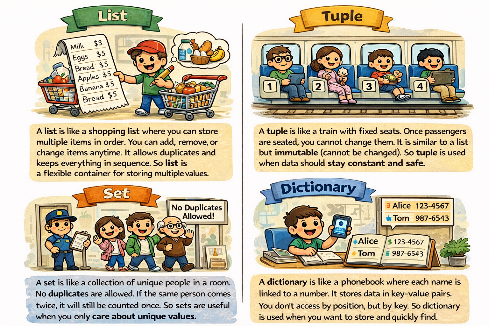

# Module 3b: Data Structures

> 🗂️ Variables store one thing. Data structures store **many things** — in an organized way. Think of it as upgrading from a single sticky note to a full filing cabinet.

---

## 🏗️ What Are Data Structures?

So far you know how to store a single value:

```python
city = "Mumbai"
population = 20000000
```

But what if you have **100 cities**? You're not going to write 100 variables. That's where data structures come in — they let you group related data together under one name.

Python has 4 main built-in data structures:

| Structure | Analogy | Ordered? | Changeable? | Duplicates? |
|---|---|---|---|---|
| **List** `[]` | Numbered to-do list 📋 | ✅ Yes | ✅ Yes | ✅ Yes |
| **Tuple** `()` | Sealed envelope 🔒 | ✅ Yes | ❌ No | ✅ Yes |
| **Set** `{}` | Bag of unique coins 🪙 | ❌ No | ✅ Yes | ❌ No |
| **Dict** `{k:v}` | Contact book 📖 | ✅ Yes | ✅ Yes | Keys: ❌ |



---

## 📋 Lists — Ordered & Changeable

A list is an **ordered sequence** of items. Items stay in the order you put them, and you can add, remove, or change them anytime.

```python
# Creating lists
fruits = ["apple", "banana", "cherry"]
user_ids = [101, 102, 103, 104]
mixed = ["Alice", 30, True, 180.5]   # lists can hold different types!
```

### Accessing Items

Lists use **index numbers** starting from `0`:

```python
print(user_ids[0])    # 101 — first item
print(user_ids[1])    # 102 — second item
print(user_ids[-1])   # 104 — last item (negative = count from end)
print(user_ids[-2])   # 103 — second from last

# Slicing — grab a range [start:end] (end is NOT included)
print(user_ids[1:3])  # [102, 103]
print(user_ids[:2])   # [101, 102] — from beginning
print(user_ids[2:])   # [103, 104] — to the end
```

!!! tip "Index starts at 0, not 1 🤓"
    This trips everyone up at first. The first item is `[0]`, second is `[1]`, and so on.
    Negative index `-1` always gives you the last item — super handy!

### Modifying Lists

```python
user_ids = [101, 102, 103, 104]

# Change an item
user_ids[1] = 999
print(user_ids)   # [101, 999, 103, 104]

# Add items
user_ids.append(105)        # add to the end
user_ids.insert(0, 100)     # insert at position 0
print(user_ids)   # [100, 101, 999, 103, 104, 105]

# Remove items
user_ids.remove(999)        # remove by value
del user_ids[0]             # remove by index
popped = user_ids.pop()     # remove & return last item
print(user_ids)   # [101, 103, 104]
print(popped)     # 105
```

### Useful List Operations

```python
nums = [5, 2, 9, 1, 5, 6]

print(len(nums))      # 6  — how many items
print(max(nums))      # 9  — largest
print(min(nums))      # 1  — smallest
print(sum(nums))      # 28 — total
print(nums.count(5))  # 2  — how many times 5 appears
print(nums.index(9))  # 2  — position of value 9

# Sorting
nums.sort()                  # sort in place: [1, 2, 5, 5, 6, 9]
nums.sort(reverse=True)      # descending: [9, 6, 5, 5, 2, 1]
sorted_copy = sorted(nums)   # new sorted list, original unchanged

# Membership check
print(2 in nums)       # True
print(10 not in nums)  # True

# Remove duplicates
unique = list(set(nums))
```

### Sorting Complex Data

```python
users = [
    {"name": "John",  "age": 25},
    {"name": "Alice", "age": 20},
    {"name": "Bob",   "age": 30}
]

users.sort(key=lambda x: x["age"])   # sort by age
print(users)
# [{'name': 'Alice', 'age': 20}, {'name': 'John', 'age': 25}, {'name': 'Bob', 'age': 30}]
```

### ⚡ List Comprehensions — The Shortcut

Instead of a loop to build a list, do it in one clean line:

```python
numbers = [1, 2, 3, 4, 5]

# Square every number
squared = [x**2 for x in numbers]
# [1, 4, 9, 16, 25]

# Only keep even numbers
evens = [x for x in numbers if x % 2 == 0]
# [2, 4]

# Uppercase words longer than 5 characters
words = ["apple", "banana", "cherry", "date"]
long_upper = [w.upper() for w in words if len(w) > 5]
# ['BANANA', 'CHERRY']

# Flatten a nested list
matrix = [[1, 2, 3], [4, 5, 6], [7, 8, 9]]
flat = [num for row in matrix for num in row]
# [1, 2, 3, 4, 5, 6, 7, 8, 9]
```

!!! tip "List comprehension syntax 📐"
    `[expression for item in iterable if condition]`

    Read it left to right: *"Give me `expression`, for each `item` in `iterable`, but only if `condition` is true."*

---

## 🔒 Tuples — Ordered & Locked

Tuples are exactly like lists, **except you can't change them** after creation. Once created, they're sealed — immutable.

```python
coordinates = (34.0522, -118.2437)   # GPS coordinates — shouldn't change
rgb_color = ("red", "green", "blue")
days = ("Mon", "Tue", "Wed", "Thu", "Fri")

# Accessing — same as lists
print(coordinates[0])    # 34.0522
print(coordinates[-1])   # -118.2437
print(days[1:4])         # ('Tue', 'Wed', 'Thu')

# Trying to modify raises an error
try:
    coordinates[0] = 99.99
except TypeError as e:
    print(f"Error: {e}")
# Error: 'tuple' object does not support item assignment
```

### Tuple Unpacking — Very Useful!

```python
point_3d = (10, 20, 30)
x, y, z = point_3d          # unpack into 3 variables at once
print(f"x={x}, y={y}, z={z}")   # x=10, y=20, z=30

# Swap two variables without a temp variable
a, b = 5, 10
a, b = b, a
print(a, b)   # 10, 5
```

!!! info "List vs Tuple — when to use which? 🤔"
    - Use a **List** when data might change — shopping cart, files to process, search results
    - Use a **Tuple** when data is fixed — GPS coordinates, RGB values, days of the week, function return values

    Tuples are also slightly faster than lists and can be used as **dictionary keys** (lists can't).

---

## 🎯 Sets — Unique Items Only

A set is an **unordered collection of unique items**. Duplicates are automatically removed. Perfect for membership testing and set math.

```python
# Duplicates removed automatically
tags = {"python", "gis", "data", "python"}   # 'python' only stored once
print(tags)   # {'python', 'gis', 'data'}

user_prefs = set(["movies", "music", "sports", "music"])
print(user_prefs)   # {'movies', 'music', 'sports'}
```

### Modifying Sets

```python
tags = {"python", "gis"}

tags.add("data")                    # add one item
tags.update(["ml", "automation"])   # add multiple items

tags.remove("gis")     # removes — raises error if not found
tags.discard("java")   # removes — NO error if not found

print(tags)   # {'python', 'data', 'ml', 'automation'}
```

### Membership Check (Lightning Fast ⚡)

```python
cities = {"Mumbai", "Delhi", "Pune", "Chennai"}

print("Delhi" in cities)    # True
print("Kolkata" in cities)  # False
```

### Set Math Operations

```python
set_a = {1, 2, 3, 4}
set_b = {3, 4, 5, 6}

print(set_a.union(set_b))                # {1, 2, 3, 4, 5, 6} — all items from both
print(set_a.intersection(set_b))         # {3, 4}             — only common items
print(set_a.difference(set_b))           # {1, 2}             — in A but NOT in B
print(set_a.symmetric_difference(set_b)) # {1, 2, 5, 6}       — in either but NOT both
```

!!! example "GIS real-world example 🗺️"
    ```python
    layers_project_a = {"roads", "rivers", "parks", "buildings"}
    layers_project_b = {"rivers", "parks", "hospitals", "schools"}

    # Which layers are shared between both projects?
    shared = layers_project_a.intersection(layers_project_b)
    print(shared)   # {'rivers', 'parks'}

    # Which layers are unique to project A?
    only_a = layers_project_a.difference(layers_project_b)
    print(only_a)   # {'roads', 'buildings'}
    ```

!!! warning "Empty set gotcha ⚠️"
    `{}` creates an empty **dictionary**, NOT a set!

    Always use `set()` for an empty set:
    ```python
    empty_set = set()    # ✅ correct
    empty_dict = {}      # this is a dict, not a set!
    ```

---

## 📖 Dictionaries — Key-Value Pairs

A dictionary stores data as **key → value** pairs. Like a real dictionary: you look up a word (key) to get its meaning (value).

```python
# Creating a dictionary
city_info = {
    "name": "Mumbai",
    "population": 20000000,
    "country": "India",
    "is_coastal": True
}
```

### Accessing Values

```python
# By key — direct access
print(city_info["name"])          # Mumbai
print(city_info["population"])    # 20000000

# Using .get() — safe access (no crash if key missing)
print(city_info.get("name"))              # Mumbai
print(city_info.get("area"))              # None — no error!
print(city_info.get("area", "Unknown"))   # Unknown — with default value
```

!!! tip "Always use `.get()` when the key might not exist 🛡️"
    `city_info["missing_key"]` → 💥 KeyError crash

    `city_info.get("missing_key", "default")` → ✅ returns default safely

### Adding, Updating & Removing

```python
user = {"name": "Alice", "age": 30}

# Add new key
user["email"] = "alice@example.com"

# Update existing key
user["age"] = 31

# Remove a key
del user["email"]
removed = user.pop("age")   # removes and returns the value
print(removed)   # 31

print(user)   # {'name': 'Alice'}
```

### Iterating Through a Dictionary

```python
student = {"name": "Ravi", "grade": "A", "score": 95}

# Loop through keys
for key in student:
    print(key)

# Loop through values
for value in student.values():
    print(value)

# Loop through both key and value
for key, value in student.items():
    print(f"{key}: {value}")
# name: Ravi
# grade: A
# score: 95
```

### Nested Data — Dicts Inside Lists

Real-world data is almost always nested. Here's how to navigate it:

```python
students = [
    {"name": "Alice", "grade": "A", "score": 95},
    {"name": "Bob",   "grade": "B", "score": 82},
    {"name": "Ravi",  "grade": "A", "score": 91}
]

# Access first student's name
print(students[0]["name"])    # Alice

# Access second student's score
print(students[1]["score"])   # 82

# Loop through all students
for student in students:
    print(f"{student['name']}: {student['score']}")
```

---

## 🔄 Mutable vs Immutable

This is one of those concepts that trips people up, but it's simple:

- **Immutable** = once created, value **cannot be changed** in memory
- **Mutable** = value **can be changed** in place

```python
# Immutable — integers
num = 10
print(id(num))    # memory address e.g. 140234567
num = num + 5     # Python creates a NEW object
print(id(num))    # different address — new object!

# Mutable — lists
my_list = [1, 2, 3]
print(id(my_list))    # memory address e.g. 140234999
my_list.append(4)     # modified IN PLACE
print(id(my_list))    # SAME address — same object, just changed
```

| Immutable (can't change) | Mutable (can change) |
|---|---|
| `int`, `float`, `str`, `bool`, `tuple` | `list`, `dict`, `set` |

---

## 📋 Shallow Copy vs Deep Copy

This matters when you copy a list or dict that contains other lists inside it.

```python
# Direct assignment — NOT a copy, just another label on the same object
original = [1, 2, [3, 4]]
referenced = original

referenced.append(5)
print(original)    # [1, 2, [3, 4], 5] — original changed too! 😱
```

```python
import copy

original = [1, 2, ["a", "b"]]

# Shallow copy — new outer list, nested objects still shared
shallow = copy.copy(original)
shallow[2].append("c")
print(original)   # [1, 2, ['a', 'b', 'c']] — nested list affected! 😬

# Deep copy — completely independent at ALL levels
deep = copy.deepcopy(original)
deep[2].append("d")
print(original)   # [1, 2, ['a', 'b', 'c']] — untouched ✅
```

!!! info "Rule of thumb 🧠"
    - Use **shallow copy** when your data has no nested mutable objects
    - Use **`copy.deepcopy()`** when you have lists inside lists or dicts inside lists

---

## 🎯 Quick Recap

| Structure | Syntax | Ordered? | Mutable? | Duplicates? | Best for |
|---|---|---|---|---|---|
| **List** | `[1, 2, 3]` | ✅ | ✅ | ✅ | Ordered, changeable collections |
| **Tuple** | `(1, 2, 3)` | ✅ | ❌ | ✅ | Fixed data, coordinates |
| **Set** | `{1, 2, 3}` | ❌ | ✅ | ❌ | Unique items, set math |
| **Dict** | `{"k": "v"}` | ✅ | ✅ | Keys: ❌ | Structured key-value data |

!!! success "Up next ➡️"
    Now that you can store and organize data, let's learn how to **do things** with it — Python Operators!
