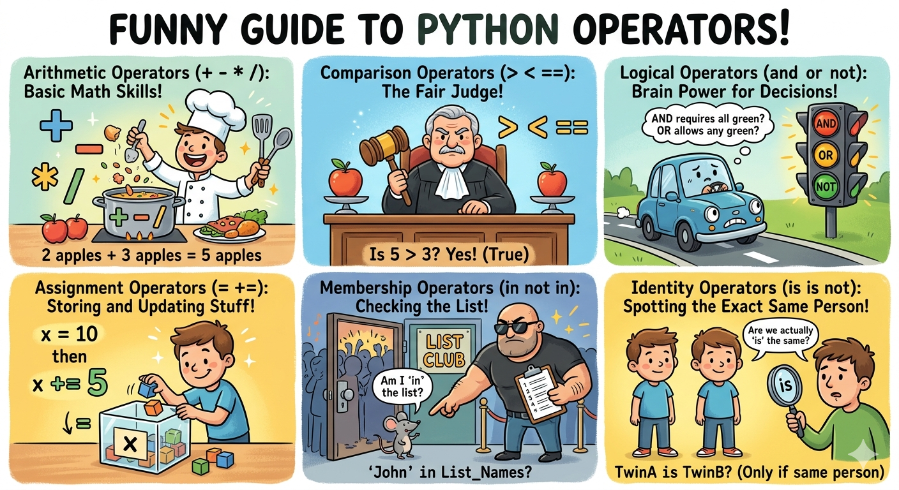

# Module 3c: Python Operators

> ➕ Operators are the **action words** of Python. They let you do math, make comparisons, combine logic, and more. Without them, your data just sits there doing nothing.

---

## What Are Operators?

An operator is a **symbol or keyword** that performs an operation on one or more values.

```python
10 + 5    # + is the operator, 10 and 5 are the operands
x == y    # == is the operator
"hi" in my_list   # 'in' is the operator
```

Python has **6 types** of operators. Let's go through each one.

---

## 1. ➕ Arithmetic Operators — The Math

These do basic mathematical calculations.

```python
a = 15
b = 4

print(a + b)    # 19    — Addition
print(a - b)    # 11    — Subtraction
print(a * b)    # 60    — Multiplication
print(a / b)    # 3.75  — Division (always returns float)
print(a // b)   # 3     — Floor Division (drops the decimal)
print(a % b)    # 3     — Modulus (remainder after division)
print(a ** b)   # 50625 — Exponentiation (15 to the power of 4)
```

| Operator | Name | Example | Result |
|---|---|---|---|
| `+` | Addition | `10 + 3` | `13` |
| `-` | Subtraction | `10 - 3` | `7` |
| `*` | Multiplication | `10 * 3` | `30` |
| `/` | Division | `10 / 3` | `3.333...` |
| `//` | Floor Division | `10 // 3` | `3` |
| `%` | Modulus | `10 % 3` | `1` |
| `**` | Exponentiation | `10 ** 3` | `1000` |

!!! tip "Modulus `%` is more useful than it looks 💡"
    `a % b` gives the **remainder** after division.

    Common uses:
    ```python
    # Check if a number is even
    if num % 2 == 0:
        print("Even!")

    # Check if divisible by 5
    if num % 5 == 0:
        print("Divisible by 5!")
    ```

!!! example "GIS real-world example 🗺️"
    ```python
    total_area_sqm = 15000
    parcel_count = 4

    avg_parcel_size = total_area_sqm / parcel_count
    print(f"Average parcel size: {avg_parcel_size} sqm")   # 3750.0 sqm

    buffer_radius = 500
    area_of_buffer = 3.14159 * buffer_radius ** 2
    print(f"Buffer area: {area_of_buffer:.2f} sqm")        # 785397.50 sqm
    ```

---

## 2. ⚖️ Comparison Operators — The Questions

These **compare two values** and always return `True` or `False`.

```python
x = 10
y = 12
z = 10

print(x == y)   # False — is x equal to y?
print(x == z)   # True  — is x equal to z?
print(x != y)   # True  — is x NOT equal to y?
print(x > y)    # False — is x greater than y?
print(x < y)    # True  — is x less than y?
print(x >= z)   # True  — is x greater than OR equal to z?
print(x <= y)   # True  — is x less than OR equal to y?
```

| Operator | Meaning | Example | Result |
|---|---|---|---|
| `==` | Equal to | `5 == 5` | `True` |
| `!=` | Not equal to | `5 != 3` | `True` |
| `>` | Greater than | `10 > 5` | `True` |
| `<` | Less than | `3 < 7` | `True` |
| `>=` | Greater than or equal | `5 >= 5` | `True` |
| `<=` | Less than or equal | `4 <= 6` | `True` |

!!! warning "= vs == — the classic beginner mistake ⚠️"
    - `=` is **assignment** → `x = 10` (store 10 in x)
    - `==` is **comparison** → `x == 10` (is x equal to 10?)

    ```python
    x = 10       # assigns 10 to x
    x == 10      # asks: is x equal to 10? → True
    ```

---

## 3. 🧠 Logical Operators — The Decision Combiners

These combine multiple `True`/`False` conditions into one.

```python
is_sunny = True
is_warm = False
is_weekend = True

# 'and' — ALL conditions must be True
print(is_sunny and is_weekend)   # True  — both are True
print(is_sunny and is_warm)      # False — is_warm is False

# 'or' — AT LEAST ONE condition must be True
print(is_sunny or is_warm)       # True  — is_sunny is True
print(is_warm or False)          # False — both are False

# 'not' — flips the value
print(not is_sunny)   # False — flips True to False
print(not is_warm)    # True  — flips False to True
```

| Operator | Meaning | Example | Result |
|---|---|---|---|
| `and` | Both must be True | `True and False` | `False` |
| `or` | At least one True | `True or False` | `True` |
| `not` | Flip the value | `not True` | `False` |

!!! example "GIS real-world example 🗺️"
    ```python
    is_dry_land = True
    is_outside_city = True
    elevation = 1200

    # All 3 conditions must be met to allow construction
    can_build = is_dry_land and is_outside_city and elevation < 2000
    print(can_build)   # True ✅

    # Alert if land is either flooded OR inside city
    needs_review = not is_dry_land or not is_outside_city
    print(needs_review)   # False — land is fine
    ```

---

## 4. 📝 Assignment Operators — The Shortcuts

You already know `=` assigns a value. But Python has **shortcut operators** that combine math + assignment in one step.

```python
score = 100

score += 10    # same as: score = score + 10  → 110
score -= 5     # same as: score = score - 5   → 105
score *= 2     # same as: score = score * 2   → 210
score /= 3     # same as: score = score / 3   → 70.0
score //= 4    # same as: score = score // 4  → 17.0
score %= 5     # same as: score = score % 5   → 2.0
score **= 3    # same as: score = score ** 3  → 8.0
```

| Operator | Example | Meaning |
|---|---|---|
| `=` | `x = 5` | Assign value |
| `+=` | `x += 3` | Add and assign |
| `-=` | `x -= 3` | Subtract and assign |
| `*=` | `x *= 3` | Multiply and assign |
| `/=` | `x /= 3` | Divide and assign |
| `//=` | `x //= 3` | Floor divide and assign |
| `%=` | `x %= 3` | Modulus and assign |
| `**=` | `x **= 3` | Power and assign |

!!! tip "Why use these? ⚡"
    Instead of writing `counter = counter + 1` in every loop, just write `counter += 1`.
    Cleaner, faster to type, and extremely common in real code.

    ```python
    # Counting files processed
    processed = 0
    for file in files:
        process(file)
        processed += 1   # much cleaner than processed = processed + 1
    ```

---

## 5. 🔍 Membership Operators — `in` and `not in`

These check whether a value **exists inside** a collection — list, tuple, set, dict, or string.

```python
fruits = ["apple", "banana", "mango"]

print("apple" in fruits)        # True  — apple is in the list
print("grape" in fruits)        # False — grape is not there
print("grape" not in fruits)    # True  — correct, grape is missing
```

Works on **all collection types**:

```python
# Strings
sentence = "Python is awesome"
print("awesome" in sentence)      # True
print("boring" not in sentence)   # True 😄

# Dictionaries — checks KEYS only
user = {"name": "Alice", "age": 30}
print("name" in user)    # True  — 'name' is a key
print("Alice" in user)   # False — 'Alice' is a VALUE, not a key
print("email" in user)   # False — no 'email' key

# Sets — fastest membership check
cities = {"Mumbai", "Delhi", "Pune"}
print("Delhi" in cities)    # True
print("Chennai" in cities)  # False
```

!!! example "GIS real-world example 🗺️"
    ```python
    valid_formats = ["shp", "geojson", "gpkg", "kml", "tif"]
    file_ext = "csv"

    if file_ext not in valid_formats:
        print(f"❌ '{file_ext}' is not a supported spatial format!")
    # ❌ 'csv' is not a supported spatial format!

    # Check if a required layer exists
    loaded_layers = {"roads", "rivers", "boundaries"}
    required = "elevation"

    if required not in loaded_layers:
        print(f"⚠️ Missing layer: {required}")
    ```

---

## 6. 🪪 Identity Operators — `is` and `is not`

These check whether two variables point to the **exact same object in memory** — not just equal values, but literally the same object.

```python
a = [1, 2, 3]
b = [1, 2, 3]
c = a             # c points to the SAME object as a

print(a == b)     # True  — same VALUE
print(a is b)     # False — different objects in memory
print(a is c)     # True  — c IS the same object as a
print(a is not b) # True  — a and b are NOT the same object
```

!!! warning "== vs is — don't mix them up! ⚠️"
    - `==` checks if values are **equal**
    - `is` checks if they are the **same object in memory**

    ```python
    x = 1000
    y = 1000
    print(x == y)   # True  — same value
    print(x is y)   # False — different objects in memory
    ```

**The most common use — checking for `None`:**

```python
result = None

# ✅ Correct way
if result is None:
    print("No result yet")

# ❌ Works but not recommended
if result == None:
    print("No result yet")
```

!!! tip "Rule of thumb 🧠"
    - Use `==` for comparing **values** (numbers, strings, lists)
    - Use `is` only when comparing against **`None`**, `True`, or `False`

---

## 🗂️ All Operators — The Full Picture



---

## 🎯 Quick Recap

| Type | Operators | What it does |
|---|---|---|
| **Arithmetic** | `+` `-` `*` `/` `//` `%` `**` | Math calculations |
| **Comparison** | `==` `!=` `>` `<` `>=` `<=` | Compare values → True/False |
| **Logical** | `and` `or` `not` | Combine conditions |
| **Assignment** | `=` `+=` `-=` `*=` `/=` etc. | Assign + math shortcut |
| **Membership** | `in` `not in` | Check if value exists in collection |
| **Identity** | `is` `is not` | Check if same object in memory |

!!! success "Up next ➡️"
    Now let's learn how to work with text data — **Type Conversion & String Manipulation**!
